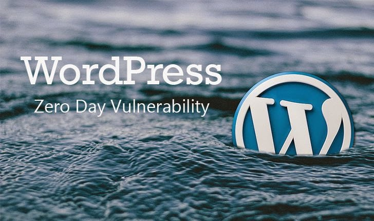
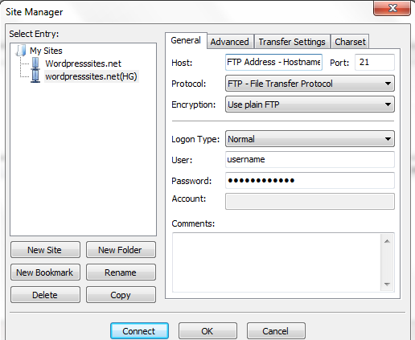
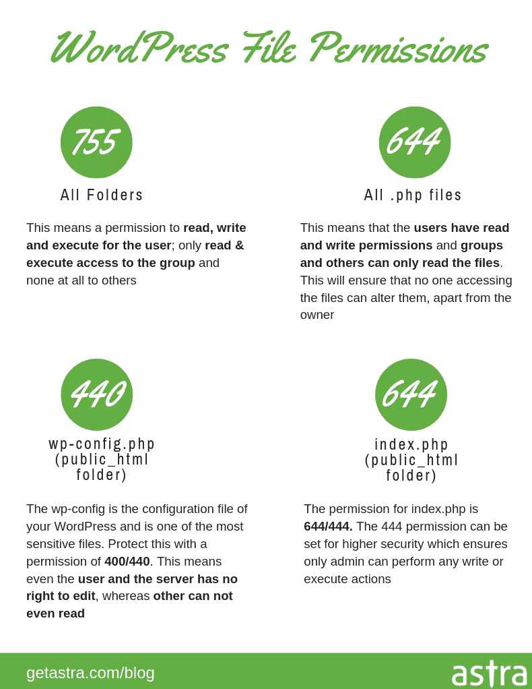

# WordPress Perils and Countermeasures 

WordPress is the most widely used Content Management System CMS on the market today. It was never build with "security" or "privacy" as a required priority.
Using this application without taking "major" countermeasures to overcome its innate flaws would be ludicrous.

## Pressing Issue # 1: Insecure FTP (File Transfer Protocol)

The WordPress application manages updates and customization via FTP. This file transfer protocol is 100% insecure! 

You have the typical catch 22: You need to update frequently because the software is full of holes. Then you use a risky protocol for those updates.

### Countermeasure: Do not use these applications and protocols based on them: FTP or ProFTP. 

 

To mitigate this, use programs/protocols like SFTP or vsFTP (Secure-FTP or Very Secure FTP)

You can find more info no secure-FTP here: 

Alternatively, you can use SCP, WinSCP.

SFTP is a Linux secure file transfer utility.
Its practical. It can be setup with key-file that are basically a 2-factor-authentification 2FA, for web file transfer.

You can also merely rely on password entropy (complex passwords), which is good enough.

Note: SFTP is a subsystem of SSH/OpenSSH and it is what constitutes a "secure FTP server".

Following are the linux commands to start the service and how to connect to it.

	service sshd start 
	
then you can connect with
	
	sftp userx@x.x.x.x (and provide your "entropy" password)
	
### Best FTP CounterMeasure: Command Line Pull Requests via WP Utility.
The best solution for insure file transfer is not use FTP, but rather base updates on the command line. 
This forces updates to use the secure of you Operating System. This puts the controls in your hand. 

We accomplish security by using the "WP" utility. [WP CLI](https://developer.wordpress.org/cli/commands/ "WP CLI, WordPress Command Line Interface"). 
It focuses all transfers via the security of your Operating System. 

#### You achieve "total security" via Operating System's SSH (Secure Shell).

### The WP Command Line Interface

You can find more information about "WP CLI", here: [WP CLI](https://kinsta.com/blog/wp-cli/#getting-wp-cli) 

Additinal information can also be found here: [More Examples](https://kinsta.com/knowledgebase/manually-update-wordpress-plugin/) 

	# Download WordPress core
	$ wp core download --locale=nl_NL
	Downloading WordPress 4.5.2 (nl_NL)...
	md5 hash verified: c5366d05b521831dd0b29dfc386e56a5
	Success: WordPress downloaded.
	
	# Install WordPress 
	$ wp core install --url=example.com --title=Example --admin_user=supervisor --admin_password=strongpassword --admin_email=info@example.com
	Success: WordPress installed successfully.
	
	# Display the WordPress version
	$ wp core version
	4.5.2

****Remember, all these commands are being ran-through a super encrypted SSH tunnel.

## Pressing Issue # 2: The WordPress Application is Very Insecure by Nature.

Using WordPress and all of its plugins and buggy themes. Application plugins and application themes are used to make WordPress a very productive tool.
These features, just as subcontractors or third-parties, introduce new vectors of complexity and insecurity. You have to vet these "enhancements" with your life. The greater the complexity, greater are the changes of security vulnerabilities, flaws and failures.

### Known Security Issues Counts (August 2020)

|Software  |Issues  |
|--|--|
|FTP  |1,088  |
|ProFTP  |45  |
|WordPress  |1,222  |
|SFTP  |35  |

### Countermeasure: Controlled Install, Configure and Upgrade WordPress with Security Focus

You can find complete instructions at this site: [Wordpress.org](https://wordpress.org/support/article/upgrading-wordpress-extended-instructions/) 

To mitigate this issue you have to "security baseline" the app and don't deploy your app until all major flaws are patched or mitigated.

For more information, you can consult the article I wrote on web applications security baselining. You can find it on GitHub.com: [Web Application Security Baselining](https://github.com/gitezri/owasp-zap-base/blob/master/README.md)

## Pressing Issue #3: Configuration Hard-Coded Passwords

This a big problem all over the industry. You are responsible to remove any Hard-coded user IDs and passwords.

## Additional Security Steps

See this article on [File permmisson Security](https://www.getastra.com/blog/cms/wordpress-security/wordpress-file-permissions/)

Fixing WP Security aka [Hardening WP](https://wordpress.org/plugins/wp-security-hardening/?utm_medium=promotioneffort&utm_campaign=promotioneffort)
